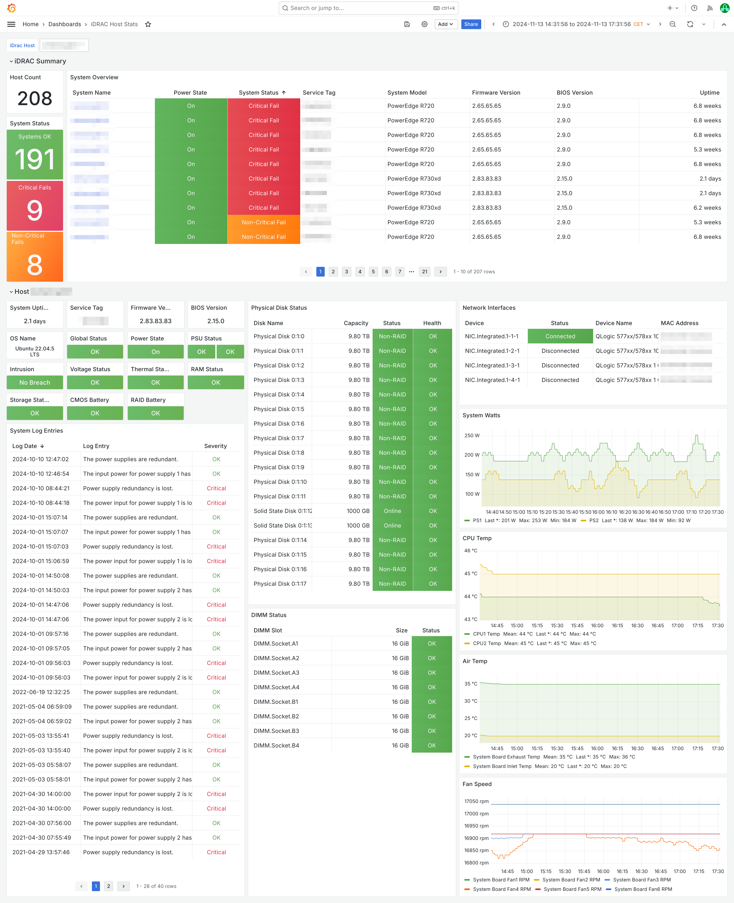

# iDrac SNMP Dashboard for Grafana (Prometheus)

Grafana dashboard with iDrac SNMP metrics for Prometheus monitoring.

The dashboard is loosely based on the original Telegraf / InfluxDB-based dashboard by [@ilovepancakes95](https://github.com/ilovepancakes95/idrac_snmp-grafana).

## Requirements

- Prometheus [snmp_exporter](https://github.com/prometheus/snmp_exporter) instance
- Grafana with Prometheus Datasource

## Files

This repository includes the dashboard JSON, the generated snmp_exporter config and the original generator config. iDRAC MIBs are not included.

- `dashboard.json` - The dashboard
- `snmp.yaml` - The snmp_exporter config (auto-generated)
- `generator.yml` - snmp_exporter config generator config ([see here](https://github.com/prometheus/snmp_exporter/tree/main/generator))

## Notes

Scraping iDrac SNMP metrics may be extremely slow depending on the number of subtrees included in your config. You should therefore set your ServiceMonitor scrape timeouts to at least 30-60s to avoid frequent scrape errors. The system event log is the most expensive table to scrape, so if you don't need it, you can simply remove the `eventLog*` entries from the walk config. If some hosts take a lot longer than others, it may also help to simply clear the event log from time to time (`racadm clrsel`).

